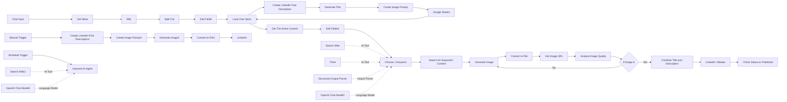

# 🚀 n8n LinkedIn Content Automation System

An AI-powered **LinkedIn content automation workflow built with n8n**. The system takes a user-provided topic, generates related keyword ideas, creates LinkedIn post content and image prompts, stores the generated content in Google Sheets, evaluates topics using web research, generates an image, performs an AI-powered image quality check, and publishes the selected post to LinkedIn through Blotato.

---

## 📌 Overview

The workflow automates the majority of the LinkedIn content creation pipeline:

```text
User Topic
    ↓
Google Keyword Suggestions
    ↓
XML Parsing & Keyword Extraction
    ↓
Keyword Loop
    ↓
AI LinkedIn Post Generation
    ↓
AI Title Generation
    ↓
AI Image Prompt Generation
    ↓
Google Sheets Storage
    ↓
AI Keyword Selection + Web Research
    ↓
Retrieve Selected Content
    ↓
AI Image Generation
    ↓
Cloudinary Image Upload
    ↓
AI Image Quality Analysis
    ↓
Quality Check
    ├── No → Regenerate Image
    └── Yes
         ↓
Combine Title + Description
         ↓
LinkedIn Publishing via Blotato
         ↓
Update Publication Status
```

The workflow also contains separate **manual/test** and **scheduled keyword-generation** branches.

---

## ✨ Key Features

* 💬 Chat-based topic input
* 🔎 Google autocomplete keyword discovery
* 🔄 Automated keyword processing loop
* ✍️ AI-generated LinkedIn post descriptions
* 🏷️ AI-generated post titles
* 🎨 AI-generated image prompts
* 📊 Google Sheets content storage
* 🌐 Real-time web research using Tavily
* 🧠 AI-powered keyword/content selection
* 🖼️ AI image generation using OpenAI
* ☁️ Cloudinary image hosting
* 🔍 AI-powered image quality validation
* ♻️ Automatic image regeneration when quality criteria are not met
* 🔗 LinkedIn publishing through Blotato
* 📝 Publication status tracking in Google Sheets
* ▶️ Manual execution branch for testing
* ⏰ Scheduled keyword-generation branch

---

# 🏗️ Workflow Architecture

The workflow is organised into several logical stages.

## 1. User Input

The main workflow begins with:

**`When chat message received`**

The user provides a topic through the n8n chat interface.

The workflow then sends the input to:

**`Get Ideas`**

This node calls Google's autocomplete endpoint to retrieve related search suggestions.

---

## 2. Keyword Extraction

The Google autocomplete response is processed through:

```text
Get Ideas
    ↓
XML
    ↓
Split Out
    ↓
Edit Fields
```

### Nodes

| Node          | Purpose                                                    |
| ------------- | ---------------------------------------------------------- |
| `Get Ideas`   | Retrieves Google autocomplete suggestions                  |
| `XML`         | Processes the XML response                                 |
| `Split Out`   | Splits `toplevel.CompleteSuggestion` into individual items |
| `Edit Fields` | Extracts the keyword into the `Keywords` field             |

The resulting keywords are passed to:

**`Loop Over Items`**

which processes the generated keyword items individually.

---

# 3. AI Content Generation

Each keyword is processed through a content-generation pipeline.

```text
Loop Over Items
      ↓
Create Linkdein Post Description
      ↓
Generate Title
      ↓
Create Image Prompt
      ↓
Google Sheets
```

### LinkedIn Post Generation

**`Create Linkdein Post Description`**

An AI agent generates a LinkedIn post based on the selected keyword.

The prompt instructs the agent to create professional content containing elements such as:

* A strong opening hook
* Relevant facts and statistics
* Professional insights
* Educational or actionable information
* A call to action
* Relevant hashtags

---

### Title Generation

**`Generate Title`**

The generated LinkedIn description is passed to another AI agent which creates a title for the post.

The workflow instructs the agent to:

* Create an engaging title
* Avoid beginning with the word "title"
* Add an emoji at the end

---

### Image Prompt Generation

**`Create Image Prompt`**

Another AI agent converts the LinkedIn post into a visual prompt for image generation.

The prompt focuses on creating professional marketing-style graphics using concepts such as:

* Flat illustrations
* Minimalist design
* Infographics
* Charts and statistics
* Abstract shapes
* Gradients
* Visual metaphors
* Professional LinkedIn-style layouts

---

# 4. Google Sheets Content Storage

The generated content is stored using the:

**`Google Sheets`**

node.

The workflow creates records containing:

| Field               | Description                                  |
| ------------------- | -------------------------------------------- |
| `Keyword`           | Generated keyword                            |
| `Post Title`        | AI-generated LinkedIn title                  |
| `Post Description`  | AI-generated LinkedIn post                   |
| `Post Image Prompt` | AI-generated visual prompt                   |
| `Status`            | Initially set to `not published`             |
| `Image URL`         | Column exists in the configured sheet schema |

This allows generated content to be stored and reused later by the selection stage.

---

# 5. AI-Powered Content Selection

After the keyword generation loop, the workflow aggregates the generated content using:

**`Get The Enitre Content`**

and passes it through:

**`Edit Fields1`**

followed by:

**`Choose 1 Keyword`**

The `Choose 1 Keyword` AI agent is designed to select one keyword from the generated content using current web information.

### AI Dependencies

The agent uses:

* `OpenAI Chat Model3`
* `Search Web`
* `Think`
* `Structured Output Parser`

### Web Research

The `Search Web` node uses **Tavily** to perform web searches.

The AI agent evaluates factors such as:

* Current relevance
* Trend potential
* Professional/business relevance
* Recent news or developments
* Potential engagement

The output is structured using:

```json
{
  "keyword": ""
}
```

---

# 6. Retrieve Selected Content

Once the AI agent selects a keyword, the workflow uses:

**`Search for Keyword's Content`**

to search Google Sheets for the corresponding keyword.

The first matching record is returned.

This allows the workflow to retrieve the previously generated:

* Post title
* Post description
* Image prompt
* Keyword

associated with the selected topic.

---

# 7. AI Image Generation

The selected content is passed to:

**`Generate Image`**

which sends the generated image prompt to OpenAI's image generation API.

The configured image generation settings include:

* Model: `gpt-image-1`
* Size: `1024x1536`
* Quality: `high`

The generated base64 image is then converted into a file using:

**`Convert to File`**

---

# 8. Cloudinary Image Upload

The generated image is uploaded using:

**`Get Image URL`**

This node sends the binary image to Cloudinary using a multipart form-data request.

The resulting Cloudinary URL is then passed to:

**`Analyze Image Quality`**

---

# 9. AI Image Quality Check

The workflow uses OpenAI image analysis to check the generated image.

The AI is specifically asked whether the image is:

* High quality
* Free from truncated text

The expected response is:

```text
yes
```

or

```text
no
```

The result is evaluated by:

**`If Image is`**

### Quality Passed

If the response is `yes`, the workflow continues to publishing:

```text
If Image is
    ↓
Combine Title and Description
```

### Quality Failed

If the response is `no`, the workflow loops back to:

```text
Generate Image
```

This allows the system to regenerate the image rather than publishing an image that fails the quality check.

---

# 10. Prepare LinkedIn Content

The:

**`Combine Title and Description`**

node creates the final LinkedIn content by combining:

```text
Generated Title + Generated Description
```

The resulting content is passed to:

**`Linkedin`**

---

# 11. LinkedIn Publishing

The main publishing node is:

**`Linkedin`**

This node uses an HTTP request to the **Blotato** API.

The request is configured for:

```text
Platform: LinkedIn
Target Type: LinkedIn
Content: Generated LinkedIn content
Media: Generated Cloudinary image URL
```

This allows the workflow to publish the generated post together with its generated image.

---

# 12. Publication Status

After the LinkedIn publishing request completes, the workflow proceeds to:

**`Check Status to Published & Save Image URL`**

This is a Google Sheets update operation.

The current JSON implementation explicitly updates:

```text
Status = published
```

and matches the relevant record using:

```text
Keyword
```

### Implementation Note

Although the Google Sheets schema contains an `Image URL` column and the node is named **`Check Status to Published & Save Image URL`**, the current JSON does **not** explicitly map a new Image URL value in this final update operation.

Therefore, the README intentionally does not claim that the final node writes the generated Cloudinary URL back into the `Image URL` column.

---

# 🔀 Alternative Workflow Branches

The workflow contains two additional branches under the `Alternatives` section.

## ▶️ Manual/Test Branch

The manual branch starts with:

```text
When clicking ‘Execute workflow’
        ↓
Create Linkdein Post Description1
        ↓
Create Image Prompt1
        ↓
Generate Image1
        ↓
Convert to File1
        ↓
LinkedIn
```

This branch provides a simplified way to manually execute a LinkedIn post generation and publishing flow.

It uses separate AI model connections:

* `OpenAI Chat Model4`
* `OpenAI Chat Model5`

and publishes through the native n8n LinkedIn node.

---

## ⏰ Scheduled Keyword Branch

The workflow also contains:

```text
Schedule Trigger
       ↓
Keyword AI Agent
```

The `Keyword AI Agent` is connected to:

* `OpenAI Chat Model6`
* `Search Web1`

The agent is configured to generate a short keyword related to **AI and automation**, using current web information and trends.

### Important

In the current workflow JSON, this scheduled branch ends at the `Keyword AI Agent`. It is **not directly connected to the main content-generation and LinkedIn-publishing pipeline**.

---

# 🧩 Technologies & Services

| Technology              | Purpose                                              |
| ----------------------- | ---------------------------------------------------- |
| **n8n**                 | Workflow automation and orchestration                |
| **OpenAI**              | Text generation, image generation and image analysis |
| **Google Autocomplete** | Related keyword discovery                            |
| **Google Sheets**       | Content storage and publication tracking             |
| **Tavily**              | Web search and current information retrieval         |
| **Cloudinary**          | Image hosting                                        |
| **Blotato**             | LinkedIn publishing API                              |
| **LinkedIn**            | Social media publishing                              |

---

# 🤖 AI Components

The workflow uses multiple AI agents and language models for specialised tasks.

### Content Generation

`Create Linkdein Post Description`

Generates the main LinkedIn post.

### Title Generation

`Generate Title`

Creates a title based on the generated post.

### Visual Prompt Generation

`Create Image Prompt`

Converts the post into a professional image-generation prompt.

### Content Selection

`Choose 1 Keyword`

Uses AI reasoning and web research to select a keyword from the generated content.

### Image Quality Analysis

`Analyze Image Quality`

Evaluates the generated image before publishing.

### Scheduled Keyword Generation

`Keyword AI Agent`

Generates an AI/automation-related keyword using web research.

---

# 📊 Data Flow

The main data flow can be summarised as:

```text
Chat Input
   ↓
Google Autocomplete
   ↓
Keyword Suggestions
   ↓
Individual Keyword Processing
   ↓
LinkedIn Post
   ↓
Title
   ↓
Image Prompt
   ↓
Google Sheets
   ↓
AI Selection
   ↓
Selected Keyword
   ↓
Stored Content
   ↓
Image Generation
   ↓
Cloudinary
   ↓
Image Quality Analysis
   ↓
Quality Decision
   ↓
LinkedIn / Blotato
   ↓
Published Status
```

---

# 🔐 Credentials Required

To run the workflow, the corresponding credentials need to be configured in n8n for the services used by the workflow.

Depending on which branches are used, these include:

* OpenAI API credentials
* Google Sheets OAuth credentials
* Tavily authentication
* Cloudinary configuration
* Blotato authentication
* LinkedIn OAuth credentials for the manual branch

**Do not commit API keys, OAuth secrets, access tokens, or other credentials to GitHub.**

---

# 🚀 Getting Started

## 1. Install n8n

Set up an n8n instance using your preferred deployment method.

## 2. Import the Workflow

Import the workflow JSON file:

```text
Project 2 - LinkedIn Post System.json
```

## 3. Configure Credentials

Connect the required credentials for:

```text
OpenAI
Google Sheets
Tavily
Cloudinary
Blotato
LinkedIn
```

## 4. Configure Google Sheets

The workflow expects a Google Sheet containing fields including:

```text
Keyword
Post Title
Post Description
Post Image Prompt
Status
Image URL
```

## 5. Test the Workflow

Use:

```text
When chat message received
```

to provide a topic and test the main automation.

The manual branch can also be tested through:

```text
When clicking ‘Execute workflow’
```

---

# 📁 Repository Structure

A suggested repository structure is:

```text
.
├── Project 2 - LinkedIn Post System.json
├── README.md
└── assets/
    └── workflow-architecture.png
```

---

# 🎯 Use Cases

This automation can be used to streamline:

* LinkedIn content creation
* AI and automation content generation
* Topic discovery
* Social media content research
* Visual content generation
* Content quality validation
* Automated LinkedIn publishing
* Content management through Google Sheets

---

# 📈 Workflow Benefits

The workflow brings multiple stages of content production into a single automated pipeline:

**Research → Generation → Storage → Selection → Visual Creation → Quality Control → Publishing**

Instead of manually researching topics, writing posts, creating visuals, checking image quality and publishing each post individually, the workflow coordinates these activities through n8n and specialised AI components.

---

# 🗺️ Architecture



---

# ⚠️ Current Implementation Notes

This README reflects the workflow JSON as currently configured.

Two implementation details are particularly important:

1. The final Google Sheets node updates the `Status` to `published` and matches using `Keyword`, but does not explicitly write the generated image URL into the `Image URL` field.

2. The `Schedule Trigger → Keyword AI Agent` branch is currently separate from the main LinkedIn content-generation and publishing pipeline.

These can be extended in future versions if the workflow is intended to become a fully scheduled end-to-end publishing system.

---

# 👨‍💻 Project

**Project:** n8n LinkedIn Content Automation System
**Platform:** n8n
**Automation:** AI-powered LinkedIn content generation and publishing
**Primary Output:** LinkedIn post + generated visual
**Storage:** Google Sheets
**Publishing:** LinkedIn via Blotato
